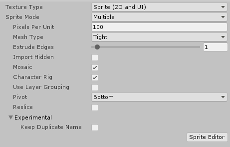
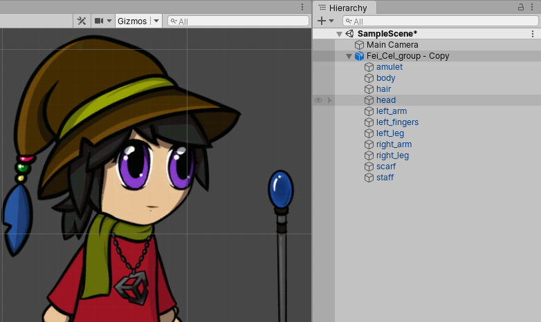
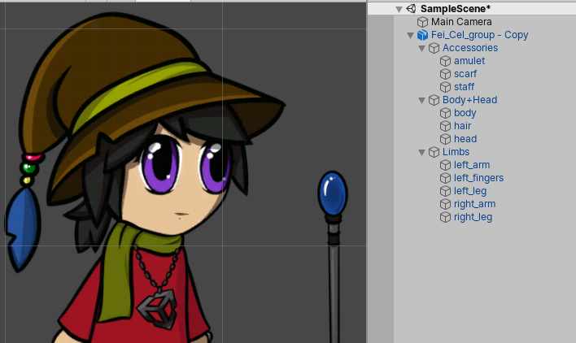
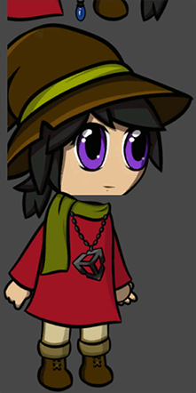
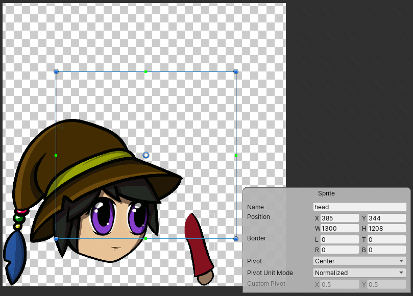
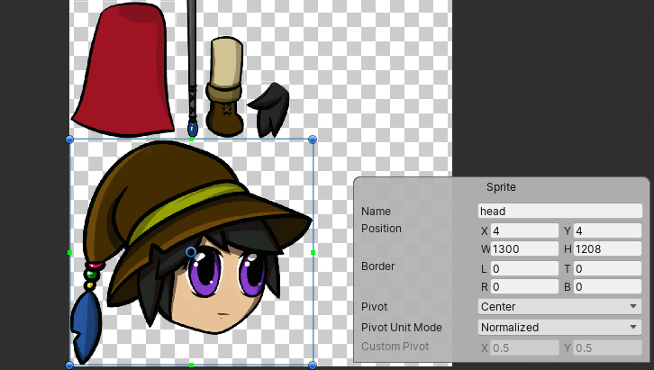

# Summary

The PSD Importer is an Asset importer that is specialized for importing Adobe Photoshop .psb files into Unity and
generating a Prefab made of Sprites based on the source file. The .psb file format is functionally identical to the more
common Adobe .psd format and can support much larger images than the .psd format (up to 300,000 by 300,000 pixels in
size).

You can save or convert your Photoshop artwork files into the .psb format and import them into Unity with the PSD
Importer. When you import .psb files with the PSD Importer, you can use features such as [Mosaic](#Mosaic) to
automatically generate a Sprite sheet from the imported layers; or [Character Rig](#Rig) where Unity reassembles the
Sprites of a character as they are arranged in their source files.

## Non-importable Photoshop effects

The PSD Importer only supports
two [Texture Modes](https://docs.unity3d.com/Manual/TextureTypes.html): [Default](https://docs.unity3d.com/Manual/TextureTypes.html#Default)
and [Sprite](https://docs.unity3d.com/Manual/TextureTypes.html#Sprite). Other Texture Modes might be supported in the
future.

The following Photoshop features are not supported by the PSD Importer and it ignores the following layer effects and
features while it generates Sprites:

* Channels

* Blend Modes

* Layer Opacity

* Effects

You can also add additional Textures to the Sprites with
the [Sprite Edito](https://docs.unity3d.com/Manual/SpriteEditor.html)r’s [Secondary Textures](https://docs.unity3d.com/Manual/SpriteEditor-SecondaryTextures.html)
module. Shaders can sample these Secondary Textures to apply additional effects to the Sprite, such as normal mapping.
For more information, see documentation
on [Sprite Editor: Secondary Textures](https://docs.unity3d.com/Manual/SpriteEditor-SecondaryTextures.html).

## Inspector properties

After importing a .psb file into your Project, select the Asset file to find the following properties in its Inspector
window.

### Texture Type - Default

This is the default Texture Type that Unity uses when you import an image without a specific Texture Type selected. For
more information, refer to the documentation on [Texture Types](https://docs.unity3d.com/Manual/TextureTypes.html).

### Texture Type - Sprite (2D and UI)

 <br/> _Importer Inspector properties_

Set the Texture Type to __Sprite (2D and UI)__ when you want to import a .psb file with character graphics on multiple
layers. The following property settings are available:

| Property                                                     | Function                                                     |
| ------------------------------------------------------------ | ------------------------------------------------------------ |
| __Texture
Type__                                             | Select [Sprite (2D and UI)](https://docs.unity3d.com/Manual/TextureTypes.html#Sprite) to import the Texture as a [Sprite](https://docs.unity3d.com/Manual/Sprites.html). This is required to begin using the imported images with the [2D Animation](https://docs.unity3d.com/Packages/com.unity.2d.animation@latest/) package. |
| __Sprite
Mode__                                              | Use this property to specify how Unity extracts the Sprite graphic from the image. The default option is __
Multiple__. |
| &nbsp;&nbsp;&nbsp;&nbsp;Single                               | Choose this option if the imported image contains a single element. |
| &nbsp;&nbsp;&nbsp;&nbsp;Multiple                             | This is the default option. Choose this option if the imported image contains multiple elements. Choose this option when importing artwork meant for animation with the [2D Animation](https://docs.unity3d.com/Packages/com.unity.2d.animation@latest/) package. |
| __Pixels Per
Unit__                                          | The number of pixels that equal to one Unity unit.           |
| __Mesh Type__                                                | This defines the __
Mesh__ type that Unity generates for the __Sprite__. This is set to __Tight__ by default. |
| &nbsp;&nbsp;&nbsp;&nbsp;[Full Rect](https://docs.unity3d.com/Documentation/ScriptReference/SpriteMeshType.FullRect.html) | Unity maps the Sprite onto a rectangular Mesh.               |
| &nbsp;&nbsp;&nbsp;&nbsp;[Tight](https://docs.unity3d.com/Documentation/ScriptReference/SpriteMeshType.Tight.html) | Unity generates a Mesh based on the outline of the Sprite. If the Sprite is smaller than 32 x 32 pixels, Unity always maps it onto a __
Full Rect__ quad Mesh, even if you select __Tight__. |
| [__Extrude
Edges__](https://docs.unity3d.com/Manual/Glossary.html#ExtrudeEdges) | Use the slider to determine how much to extend the Mesh from the edge of the Sprite. |
| __Import
Hidden__                                            | Enable this property to include the hidden [layers](https://helpx.adobe.com/photoshop/using/layer-basics.html#layers_panel_overview) of the .psb file in the import. This produces the same import result as making all layers visible in the source file unhiding all layers in the source file before you importing it into Unity. Clear this option if you want to only import the visible layers in the .psb file. |
| __Mosaic__<a name="Mosaic"></a>                              | This setting is only available if you set the __Texture
Type__ to __
Multiple__. Enable this setting to make the PSD Importer generate Sprites from the imported layers and combine them into a single Texture in a Sprite sheet layout. |
| [__Character
Rig__](#Rig)                                    | Enable this property to make the importer generate a [Prefab](https://docs.unity3d.com/Manual/Prefabs.html) based on the imported source file. The PSD Importer generates Sprites from the imported layers of the source file, and the Sprites’ [hierarchy](https://docs.unity3d.com/Manual/Hierarchy.html) and positions are based on their [layer hierarchy](https://helpx.adobe.com/photoshop/using/layer-basics.html#layers_panel_overview) and their positions in the .psb file. |
| __Use Layer Grouping__                                       | This setting is only available when you enable __
Character
Rig__. Enable this setting to make the importer generate a Prefab that follows the layer and grouping hierarchy of the imported .psb. file. |
| __
Pivot__                                                    | Choose the pivot point of the Sprite.                        |
| &nbsp;&nbsp;&nbsp;&nbsp; Custom                              | Define the X and Y coordinates of a custom __
Pivot__ location. |
| [__Reslice__](#Reslice)                                      | Available only when you enable __
Mosaic__. Enable this setting to regenerate the Sprite from the imported layers and clear any changes you have made to the Sprite and its metadata. |
| __
Experimental__                                             | The following feature is experimental and might be changed or removed in the future. It is only available for the following Editor and package versions:  <br />- __
Unity 2019.2__: 2D PSD Importer version 1.2.0-preview.4 or newer.<br />- __Unity
2019.3__: 2D PSD Importer version 2.0.5 or newer. |
| &nbsp;&nbsp;&nbsp;&nbsp; [Keep Duplicate Name](#Duplicate)    | Enable this setting to make the PSD Importer generate Sprites from the source files with the exact same name as their source layers, even when there are multiple layers with the same name. |

## Property details

### Character Rig<a name="Rig"></a>

The __Character Rig__ setting makes the PSD Importer generate a Prefab that
contains [Sprites](https://docs.unity3d.com/Manual/Sprites.html) it generates from each layer of the imported source
file. The PSD Importer automatically gives the Sprites
an [Order in Layer](https://docs.unity3d.com/Manual/2DSorting.html#sortlayer) value that sorts them according to the
layer hierarchy in the source file. This ensures that Unity recreates the character artwork in the correct order in the
Prefab.

The name of each Sprite in the Prefab is the same as their respective source layer, unless
a [name collision error](#NameCollision) occurs, which is usually due to duplicate names in the source layers.

If the Sprite contains bone or weight data, the PSD Importer automatically adds the __Sprite Skin__ component to it.
This happens if the Sprite has
been [rigged](https://docs.unity3d.com/Packages/com.unity.2d.animation@3.0/manual/CharacterRig.html) with bones and
weights in
the [Skinning Editor](https://docs.unity3d.com/Packages/com.unity.2d.animation@3.0/manual/SkinningEditor.html) already
and the source file is being reimported, or you have
manually [copied and pasted](https://docs.unity3d.com/Packages/com.unity.2d.animation@3.0/manual/CopyPasteSkele.html)
the bone and weight data onto the Sprites.

Refer to the examples below of a character designed in Photoshop with its various parts and limbs separated onto
different layers.

 <br/> _Character artwork in Photoshop with different parts separated into different
Photoshop layers._

 <br/>_The generated Prefab with Sprites sorted according to the source file’s layer
hierarchy._

 <br/> _The Prefab with the Layer Grouping setting enabled._

### Reslice<a name="Reslice"></a>

Enable this setting to discard all user modifications for the current set of SpriteRect data and regenerate all
SpriteRects based on the current source file. Extra SpriteRect metadata (such as weights and bones data) persist if they
remain valid with the regenerated SpriteRects.

## How the PSD Importer uses SpriteRect data

The PSD Importer can store four separate sets of [SpriteRect](https://docs.unity3d.com/ScriptReference/Sprite-rect.html)
data, with a set for each of the four combinations of importer property settings below:

1. __Sprite Mode__ set to __Single__.

2. __Sprite Mode__ set to __Multiple__.

3. __Sprite Mode__ set to __Multiple,__ and __Mosaic__ enabled.

4. __Sprite Mode__ set to __Multiple__, and both __Mosaic__ and __Character Rig__ enabled.

Each set of data is persistent, and does not affect or overwrite the data of other sets. This means you can save
different SpriteRect data for different importer settings for the same source file. The SpriteRect data persists even if
you modify the dimensions and position of images in the source file, as long as the
original [Layer ID](https://github.com/adobe-photoshop/generator-core/wiki/Understanding-Layer-IDs-and-Layer-Indices) of
the source layers remain the same.

### Modifying the SpriteRect data

The SpriteRect defines the location of the Sprite on the Texture that Unity generates from the imported source file. You
can modify the location and size of each SpriteRect in the Sprite Editor.

<br/>_Original SpriteRect location of the ‘head’ Sprite on the combined Sprite sheet
Texture._

 <br/> _Drag the corners of the SpriteRect to modify its dimensions and location, or enter
the coordinates and dimensions in the Sprite panel._

A SpriteRect’s modified dimensions and location on the Texture is reflected for its respective Sprite in the Scene view.

|                             |                             |
| ------------------------------------------------------------ | ------------------------------------------------------------ |
| _Original character prefab and its ‘head’ Sprite with unmodified SpriteRect data._ | _Character prefab with its ‘head’
Sprite’s SpriteRect data modified._ |

When you enable the [Mosaic](#Mosaic) importer setting, the PSD Importer arranges the different layers of the source
file together to form a single combined Texture when you import it. The importer generates a SpriteRect for each of
these imported layers, and follows the position of its associated layer wherever it is placed in the Mosaic Texture.

<br/>_The SpriteRect of the ‘head’ layer. The SpriteRect has been moved from its original
position._

<br/>_The source file reimported after hiding several layers. The SpriteRect follows
the ‘head’ layer’s placement in the new Texture._

However, a SpriteRect’s size and position remains the same if you change the image or canvas size of its source layer in
the source file. You must manually edit the size and position of the SpriteRect in the Sprite Editor, or select and
apply the [Reslice](#heading=h.i7pxu2xdxrji) option to regenerate it from the source file.

<br/>_Original position and size of the SpriteRect for the generated ‘head’ Sprite._

<br/>_Position and size of the SpriteRect remains the same after increasing
the image size of its source layer._

SpriteRect data persists until you manually delete the SpriteRect, or select the [Reslice](#heading=h.i7pxu2xdxrji)
option and apply it in the importer settings. When you do this, Unity discards all user modifications for the current
set of SpriteRect data and regenerates all the SpriteRects from the current source file.

### Summary of source file modifications and their effects on SpriteRect data

| __Modification to the source file__             | __Effect on SpriteRect data__                                |
| ----------------------------------------------- | ------------------------------------------------------------ |
| __New layer added /layer visibility turned
on__ | The PSD importer automatically generates a new Sprite from the new layer, or newly visible layer, with its associated SpriteRect. |
| __Layer deleted /layer visibility turned
off__  | The Sprite and SpriteRect that the PSD Importer generated from the deleted or previously visible layer are also deleted from the Project file. |
| __Layer is
renamed__                            | By default, the SpriteRect copies the new name of its source layer. However if you rename the SpriteRect in the Sprite Editor, then it retains its modified name and does not copy the source layer’s new name. |
| __Layer or canvas size
changed__                | When a source layer is resized, the size and position of its related SpriteRect remains the same and does not reflect the changes made to its source layer. To make the SpriteRect reflect the changes made to its source layer, manually edit the SpriteRect’s dimensions in the Sprite Editor or select and apply the [Reslice](#Reslice) option in the PSD Importer settings. |

## Name collision errors <a name="NameCollision"></a>

A name collision error can happen due to the following :

1. Two or more layers in the imported source file have the same name. However,
   Photoshop [group layers](https://helpx.adobe.com/photoshop/using/selecting-grouping-linking-layers.html#group_and_link_layers)
   with the same names do not cause this issue.

2. A new layer that the PSD Importer creates in the source file has the same name as a SpriteRect you have created or
   modified.

3. A layer is renamed to the same name as a SpriteRect you have modified.

4. A previously hidden layer is made visible and imported, and it has the same name as an existing SpriteRect.

When a name collision occurs, one SpriteRect retains the original name while the other is appended with a running
number. Which SpriteRect retains their original name is based on the following priority:

1. A SpriteRect you have created or modified.

2. The first layer in the source file, starting from the bottom of the layer stack.

3. Currently existing SpriteRects in the Project.

## Experimental feature: Keep duplicate names <a name="Duplicate"></a>

Unity’s default import behavior when there are duplicate names is to append "_[number]" to Sprites and SpriteRects it
generates from source layers with identical names. Enable this experimental feature to instead have Unity give both
Sprites/SpriteRects the exact same name as their source layer even if they have duplicate names.

## PSD File Importer Override

It is possible to use PSDImporter to import files with 'psd' extensions. The following are the sample scripts that you
can use.

#### PSDImporterOverride.cs

```
using UnityEngine;

namespace UnityEditor.U2D.PSD
{
    [AssetImporters.ScriptedImporter(1, new string[0],new[] {"psd"} )]
    internal class PSDImporterOverride : PSDImporter
    {
    }
}
```

#### PSDImporterOverrideEditor.cs

```
namespace UnityEditor.U2D.PSD
{
    [CustomEditor(typeof(UnityEditor.U2D.PSD.PSDImporterOverride))]
    internal class PSDImporterOverrideEditor : PSDImporterEditor
    {
    }

}
```

After implementing the above scripts, you will be able to switch the importer from a dropdown list in the Inspector.


